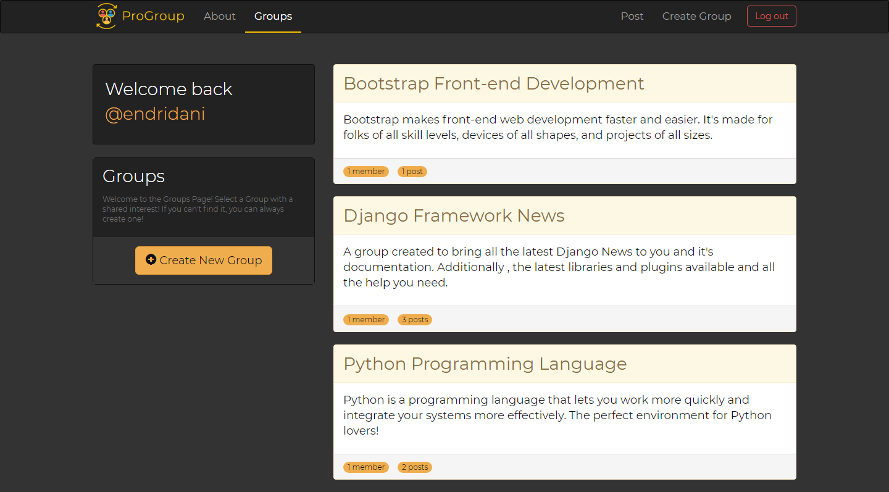
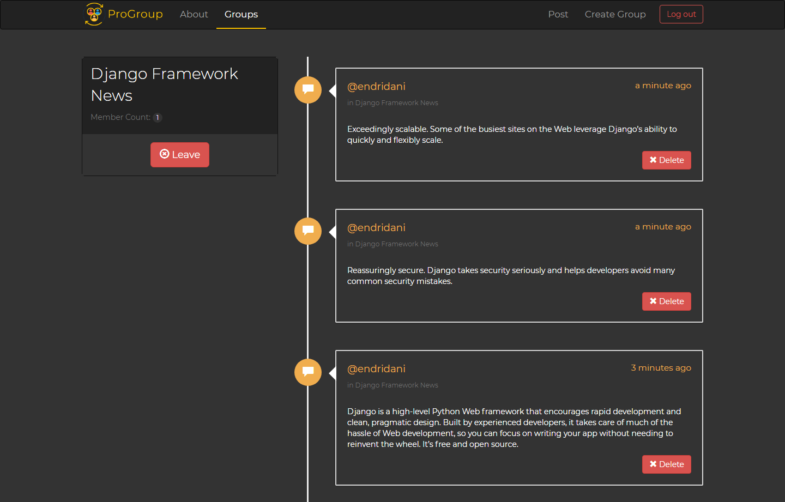

# A Simplified Social Network

This simplified social network is a project containing 3 different apps. It includes a full authentication system where various users
can register and login. Users can contribute by creating groups(representing hobbies or interests) and writing posts belonging to these
groups. Users have the option to Join or Leave a group, Delete Comments created by them and each has it's own profile listing their Post History.

This project serves as a great example to understand the structure of a project built upon various apps and the relation between it's 
compartments.

Screenshot samples from this Django project.

